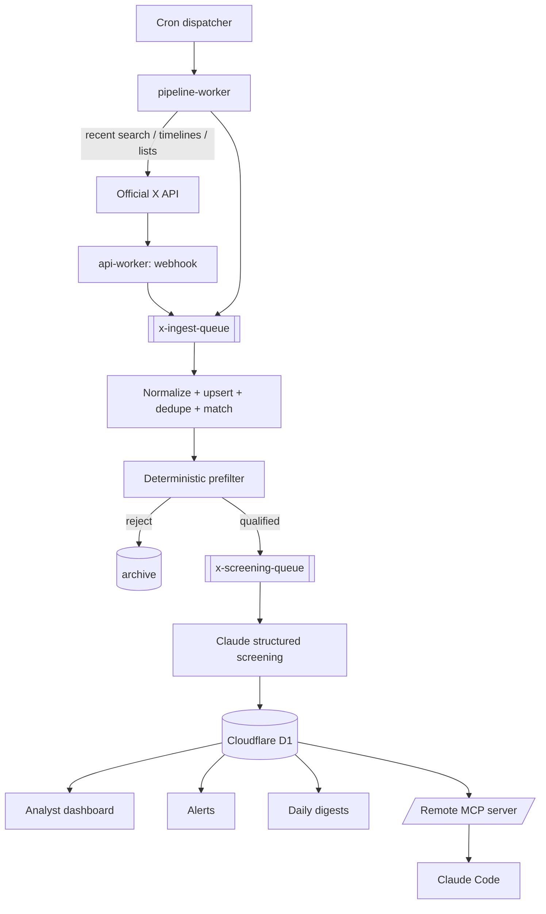

# X Intelligence Engine (XIE)

A private intelligence application that continuously collects selected public posts from
the **official X API**, runs a deterministic relevance prefilter, sends only qualified
candidates to Claude for structured screening, stores results in Cloudflare D1, and
exposes a professional analyst dashboard plus a secure remote MCP server for Claude Code.

> Built for AI/ML, AI-for-biology, drug discovery, oncology, ctDNA/MRD, genomics,
> long-read sequencing, regulatory, and biopharma competitive intelligence.

## Architecture



## Monorepo layout

```
apps/web            React + Vite SPA (Cloudflare Pages)
apps/api-worker     Hono REST API + MCP endpoint + X webhook (Workers)
apps/pipeline-worker Cron + queue consumers: collect/prefilter/screen/digest (Workers)
packages/shared     Canonical types, errors, logging, string-safe ids, URL builder
packages/config     Env, pricing, budgets, score bands, scheduling, prompt versions
packages/db         D1 migrations + typed repository layer (all SQL lives here)
packages/x-client   Official X API client + normalization + rate-limit + webhook HMAC
packages/screening  Deterministic prefilter + Claude prompt/schema/client + alert eval
packages/mcp        Read-only MCP tools over the local DB
```

## Capabilities

- Official-X-API-only collection (recent search, user/list timelines, webhook) with
  capability detection and graceful polling fallback.
- Deterministic, versioned, unit-tested prefilter with factor-level explanations.
- Claude structured screening (forced tool-use + strict validation + repair retry) with
  prompt-injection defenses.
- Cost controls: daily/monthly X budgets, daily Claude budget, hard-stop, usage accounting.
- Idempotent pipeline (unique constraints, deterministic job keys, upserts) safe against
  Cloudflare Queues' at-least-once delivery.
- Alerts, daily digests (assembled from stored records — no invented facts), analyst
  dashboard, and a secure remote MCP server (read-only by default).

## Prerequisites

- Node >= 20 (developed on 24), pnpm 11, a Cloudflare account, an X developer bearer
  token, and an Anthropic API key. Wrangler for deployment.

## Local setup

```powershell
pnpm install
cp .env.example .dev.vars      # fill in secrets locally (never commit)
pnpm typecheck
pnpm test
pnpm --filter @xie/web dev     # SPA at http://localhost:5173
# workers: `pnpm --filter @xie/api-worker dev` etc. (needs wrangler + a local D1)
```

Apply migrations locally:

```powershell
pnpm db:migrate:local
```

## Environment variables

See [`.env.example`](.env.example). Secrets (X bearer, Anthropic key, MCP token, Access
config) are **server-side only** and are never sent to the browser.

## Tests & build

```powershell
pnpm typecheck   # all workspaces
pnpm test        # 79 tests (see docs/VERIFICATION.md)
pnpm --filter @xie/web build
```

## Deployment

Full, exact steps: [`docs/CLOUDFLARE_SETUP.md`](docs/CLOUDFLARE_SETUP.md). Also see
[`docs/X_API_SETUP.md`](docs/X_API_SETUP.md), [`docs/CLAUDE_SETUP.md`](docs/CLAUDE_SETUP.md),
[`docs/MCP_SETUP.md`](docs/MCP_SETUP.md).

## Security

- No scraping — official X API only.
- All external content (posts, bios, URLs, webhook payloads) is untrusted; rendered as
  plain text (never `dangerouslySetInnerHTML`); the screening prompt defends against
  injection.
- No secret logging; structured JSON logs redact secret-bearing fields.
- Webhook signatures verified with constant-time HMAC; SSRF-guarded outbound URL checks.
- Server-side authorization on every sensitive route (Cloudflare Access in production;
  dev-auth is refused in production).

## Cost controls

Configurable X daily/monthly budgets, Claude daily budget, hard-stop, per-monitor caps,
`since_id` checkpoints, deterministic prefilter before Claude, and a usage/cost view.

## Known limitations

- X webhook signature protocol must be confirmed against current official X docs before
  enabling in production (documented in-code).
- Watchlist CRUD, Miniflare route integration tests, and ESLint config are scaffolded but
  not exhaustive — see [`docs/BUILD_STATUS.md`](docs/BUILD_STATUS.md).
- Optional Vectorize semantic search and R2 raw archiving are feature-flagged off by
  default; core works without them.

## Troubleshooting

- "X API not configured" / "Claude screening not configured" — the corresponding secret
  is unset; the app reports the gap instead of failing.
- Budget-exceeded runs are recorded distinctly from failed / not-due / disabled.
- `wrangler tail` on each worker to watch cron + queue processing.
